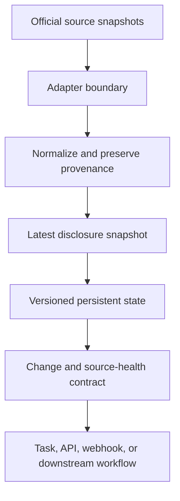

# Regulatory Data Layer — Public Demo

A portfolio demonstration of a **stateful regulatory short-position change-data layer**.

This repository is intentionally **not** the production source code of the live Apify Actor. It contains a small, deterministic Python demo that explains the design decisions behind reliable regulatory-data monitoring without publishing production adapters, state stores, historical snapshots, or operational configuration.

**Live product:** [Regulatory Short Position Change Layer](https://apify.com/highbrow_qualification_z7w/regulatory-short-position-change-layer)  
**Public Task:** [Monitor European Regulatory Short Positions](https://apify.com/highbrow_qualification_z7w/regulatory-short-position-change-layer/examples/monitor-european-regulatory-short-positions)

## The problem

Downloading a regulator's public file repeatedly is not a monitoring system. A useful downstream feed must distinguish:

- an initial baseline from a later change;
- current-register sources from lifecycle-history sources;
- a genuine closure from a temporary source failure;
- raw source rows from the latest disclosure state for one position identity.

The demo models a stable identity as `source + ISIN + holder`, selects the latest dated row per identity, persists a versioned snapshot, and emits deterministic change events.

## What this demo includes

- Pure-Python snapshot normalisation and comparison.
- Lifecycle-row deduplication using the latest available date.
- Baseline, new, increased, decreased, correction, unchanged, and closed events.
- Failure-safe retention: a failed source cannot generate false closure events.
- A documented event contract, architecture diagram, fixture data, and tests.

## What it intentionally excludes

- Production source adapters and endpoints.
- Credentials, user state, run history, deployment configuration, and platform secrets.
- Claims of full European or global coverage.
- Trading signals, investment recommendations, or market-data licensing claims.

The live product currently integrates six public European regulatory sources: Norway, France, Netherlands, Germany, Ireland, and Spain. Coverage expansion requires separate legal-reuse, stability, and semantic-compatibility review.

## Architecture



See [docs/architecture.md](docs/architecture.md) for the design rationale and [docs/demo-scenario.md](docs/demo-scenario.md) for the controlled scenario.

## Run the demo

Requires Python 3.11+ and no third-party packages.

```bash
python demo_monitor.py
python -m unittest discover -s tests -v
```

## Event semantics

| Event | Meaning |
|---|---|
| `BASELINE_POSITION` | First observed position for a new monitoring state. |
| `NEW_POSITION` | Position appeared after a baseline existed. |
| `POSITION_INCREASED` / `POSITION_DECREASED` | Published disclosed percentage changed. |
| `SOURCE_CORRECTION` | Source date/value changed without a directional percentage change. |
| `POSITION_CLOSED` | Record is absent from a successfully retrieved public snapshot. It does **not** prove the underlying economic position is zero. |
| `UNCHANGED` | Latest public disclosure state is equivalent to the previous snapshot. |

## Design note

The architecture is intended to demonstrate data-product thinking across API integration, schema normalisation, stateful processing, source-health observability, and operational correctness. It is deliberately small enough to review in one sitting.
