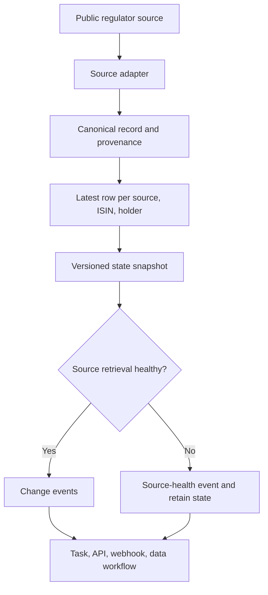

# Architecture and operational contract

## Why this is a layer, not a downloader

A regulator may expose a current public register, a daily CSV, or a lifecycle-history file. Those sources have different transport and row semantics, but downstream consumers need one predictable event contract. The layer isolates that variability at the adapter boundary.

## Core boundaries

| Boundary | Responsibility | Failure it prevents |
|---|---|---|
| Adapter | Read a source and preserve source-specific provenance. | A format change leaking into every consumer. |
| Normalisation | Map source rows to stable identities and canonical values. | Treating a reordered file as a change. |
| Snapshot | Keep only the newest disclosure row per identity. | Duplicating lifecycle history as active positions. |
| Stateful comparator | Compare current and previous snapshots idempotently. | Re-emitting the full register every day. |
| Source health | Report successful, empty, and failed retrieval separately. | Generating false closures during an outage. |
| Output contract | Emit schema-stable change and health records. | Forcing downstream systems to parse source formats. |

## Data semantics

The stable public-disclosure identity is `source + ISIN + holder`.

The source identifier is part of the identity because the same issuer and holder can be disclosed by different regimes with different publication semantics.

`POSITION_CLOSED` means that a record was absent from a successfully retrieved public snapshot. It is a statement about the disclosure register, not a claim about the holder's economic position. On a failed source retrieval, the previous source state is retained and a health record is emitted instead.

## Production-readiness questions illustrated by the demo

- Which raw fields are authoritative for effective date and recency?
- Is an empty response a valid empty register or an upstream failure?
- What is the rollback behaviour if a source is unavailable?
- Which event payload fields allow audit and reproducibility?
- Which source changes require an adapter release rather than a downstream schema change?

The live Actor implements these concerns for its supported sources. This repository demonstrates the architecture, not the production integration set.
